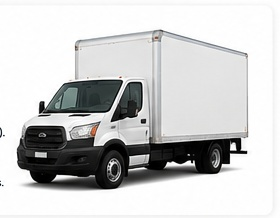

# Replacing the Photo Placeholders

The site intentionally does not include the low-resolution truck images from the old marketing sheet.

## Best image sizes

For the fleet sections, aim for:

```text
1800 x 1200 px or larger
Landscape orientation
JPG or WebP
```

For the large split section near the bottom:

```text
2000 x 1400 px or larger
Landscape orientation
```

## Suggested filenames

Put images inside `assets/`:

```text
assets/unit-01.jpg
assets/unit-02.jpg
assets/unit-03.jpg
assets/rch-hero.jpg
```

## Replace a placeholder

Find:

```html
<div class="photo-placeholder">
  <span>UNIT 01 PHOTO</span>
  <small>Drop your box truck photo here later</small>
</div>
```

Replace it with:

```html

```

The CSS already includes:

```css
.business-photo {
  width: 100%;
  height: 100%;
  min-height: 500px;
  object-fit: cover;
}
```

So the image will automatically fill the area cleanly.

## Photography direction

For the strongest look:
- shoot trucks outdoors in clean light
- keep the entire vehicle visible
- avoid parking-lot clutter if possible
- leave some empty space around the vehicle
- take horizontal photos
- use the same general angle/style for all three trucks
- take one strong image of Eduardo / the team / trucks together for the brand section
